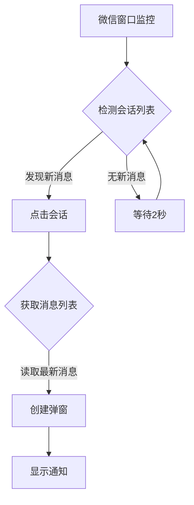
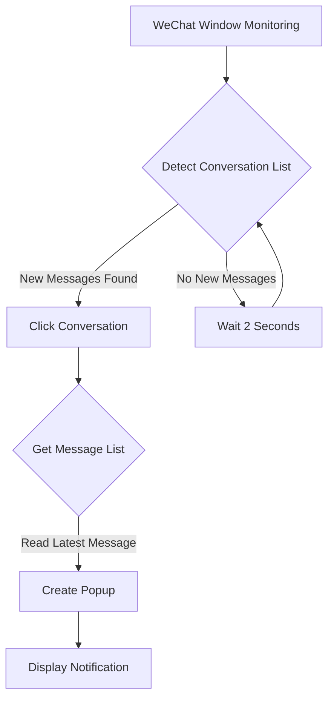

# 微信消息弹窗 / WeChat Notification Popup  
**中文版 | [English Version](#wechat-notification-popup-for-windows)**

---

## 微信消息弹窗 - Windows微信消息提醒工具 (Beta)


**微信消息弹窗** 是一个基于Python开发的Windows微信消息提醒工具，解决了官方客户端在后台运行时无法显示新消息弹窗的问题。本工具提供美观的弹窗通知，包含微信图标、好友昵称和消息内容显示。

> **注意**: 当前为Beta版本，存在已知限制。欢迎开发者贡献代码解决后台检测问题！

### 🌟 功能亮点
#### 🪟 消息弹窗提醒
- 在屏幕左上角显示消息弹窗（后续版本将支持位置自定义）
- 完整显示好友昵称和消息内容
- 自动显示当前时间标记

#### 🖼️ 微信图标支持
- 内置微信应用图标（WCLogo.png）
- 自动适应不同分辨率
- 图标加载失败时显示绿色替代图标

  

#### 🛠️ 后台监控
- 实时监控微信会话列表
- 自动识别新消息并触发弹窗
- 支持多消息批量处理

#### 📌 系统托盘集成
- 后台运行时在系统托盘显示微信图标
- 提供便捷的退出选项
- 状态提示功能

### ⚠️ 已知问题 (Beta版本限制)
1. **后台检测限制**：
   - 当前版本仅在微信窗口处于打开状态时才能检测新消息
   - 当微信最小化到系统托盘或后台运行时，无法检测新消息
   - *寻求帮助：欢迎有大佬指点如何解决后台消息检测问题！*

2. **位置固定**：
   - 弹窗目前固定在屏幕左上角（后续版本将支持位置自定义）

3. **依赖要求**：
   - 需要完整安装Python环境及依赖库
   - 需要正确配置微信安装路径

### 📦 安装与使用
#### 系统要求
- Windows 10 或更高版本
- Python 3.7+
- 已安装官方微信桌面版

#### 安装步骤
1. 克隆本仓库或下载源代码：
   ```bash
   git clone https://github.com/mirage彬/wechat-notification.git
   cd wechat-notification
   ```

2. 安装依赖库：
   ```bash
   pip install -r requirements.txt
   ```

3. 配置微信安装路径：
   - 打开 `wechat_notifier.py` 文件
   - 修改 `self.wechat_install_path` 为你的微信安装路径（例如：`r"D:\Program Files\WeChat"`）

4. 运行程序：
   ```bash
   python wechat_notifier.py
   ```

#### 使用说明
1. 确保微信已登录并保持窗口打开（非最小化到托盘）
2. 程序启动后，将在系统托盘显示微信图标
3. 收到新消息时，屏幕左上角将显示弹窗通知
4. 右键点击系统托盘图标选择"退出"可关闭程序

### 🧩 技术细节
#### 实现原理


#### 核心依赖
- `uiautomation` - Windows UI自动化控制
- `pystray` - 系统托盘图标支持
- `Pillow` - 图像处理
- `tkinter` - 图形界面弹窗

#### 文件结构
```
wechat-notification/
├── wechat_notifier.py   # 主程序
├── WCLogo.png           # 微信图标
├── requirements.txt     # 依赖列表
├── README.md            # 说明文档
└── LICENSE              # 许可证文件
```

### ❓ 常见问题
#### Q: 为什么收不到消息提醒？
A: 请检查：
1. 微信窗口是否处于打开状态（非最小化到托盘）
2. 配置的微信安装路径是否正确
3. 控制台是否有错误输出

#### Q: 弹窗位置可以调整吗？
A: 当前版本固定在左上角，后续版本将支持自定义位置。开发者可自行修改代码中的弹窗位置（`create_popup`函数内的`x`和`y`坐标）。

#### Q: 如何实现后台运行？
A: 当前版本无法在微信后台运行时检测消息，这是已知限制。欢迎贡献代码解决此问题！

#### Q: 是否支持企业微信？
A: 当前仅支持个人微信。

### 🤝 寻求贡献
我们特别需要解决以下问题：
- **后台消息检测**：当微信最小化到托盘或后台时如何检测新消息？
- **更可靠的消息捕获**：改进消息捕获机制，避免漏消息
- **弹窗位置自定义**：实现用户可配置的弹窗位置

欢迎提交Pull Request或Issue讨论解决方案！

### 🧪 开发指南
1. 安装开发依赖：
   ```bash
   pip install -r requirements.txt
   ```

2. 代码主要结构：
   - `WeChatNotifier` 类：主程序逻辑
   - `get_wxid()`：获取当前微信用户ID
   - `get_avatar_path()`：获取联系人头像
   - `create_popup()`：创建消息弹窗
   - `monitor_wechat()`：微信消息监控循环

3. 调试提示：
   - 启用详细日志输出
   - 检查微信会话列表的UI结构变化
   - 测试不同微信版本兼容性

### 📜 许可证
本项目采用 MIT 许可证 - 详情请参阅 [LICENSE](LICENSE) 文件。

### 📞 联系作者
- 开发者: mirage彬
- 邮箱: [你的邮箱]
- 项目地址: [GitHub仓库URL]

---

**微信消息弹窗** © 2023 mirage彬。开源项目，欢迎贡献！

---

<a id="wechat-notification-popup-for-windows"></a>
## WeChat Notification Popup for Windows


**WeChat Notification Popup** is a Python-based message notification tool for Windows WeChat that solves the problem of missing message popups when the official client runs in the background. This tool provides elegant popup notifications containing the WeChat icon, contact nickname, and message content.

> **Note**: This is currently a Beta version with known limitations. Developer contributions are welcome to solve the background detection issue!

### 🌟 Key Features
#### 🪟 Message Popup Notification
- Displays message popups in the top-left corner of the screen (future versions will support custom positioning)
- Shows complete contact nickname and message content
- Automatically displays current timestamp

#### 🖼️ WeChat Icon Support
- Built-in WeChat application icon (WCLogo.png)
- Automatically adapts to different screen resolutions
- Displays green placeholder icon if loading fails

#### 🛠️ Background Monitoring
- Real-time monitoring of WeChat conversation list
- Automatically detects new messages and triggers popups
- Supports batch processing of multiple messages

#### 📌 System Tray Integration
- Displays WeChat icon in system tray when running in background
- Provides convenient exit option
- Status notification functionality

### ⚠️ Known Issues (Beta Limitations)
1. **Background Detection Limitations**:
   - Current version only detects new messages when WeChat window is open
   - Cannot detect new messages when WeChat is minimized to system tray or running in background
   - *Help Wanted: Contributions welcome to solve background message detection!*

2. **Fixed Position**:
   - Popups currently fixed at top-left corner (future versions will support custom positioning)

3. **Dependency Requirements**:
   - Requires complete Python environment and dependencies
   - Requires correct configuration of WeChat installation path

### 📦 Installation & Usage
#### System Requirements
- Windows 10 or higher
- Python 3.7+
- Official WeChat Desktop version installed

#### Installation Steps
1. Clone repository or download source code:
   ```bash
   git clone https://github.com/mirage彬/wechat-notification.git
   cd wechat-notification
   ```

2. Install dependencies:
   ```bash
   pip install -r requirements.txt
   ```

3. Configure WeChat installation path:
   - Open `wechat_notifier.py` file
   - Modify `self.wechat_install_path` to your WeChat installation path (e.g., `r"D:\Program Files\WeChat"`)

4. Run the program:
   ```bash
   python wechat_notifier.py
   ```

#### Usage Instructions
1. Ensure WeChat is logged in and window is open (not minimized to tray)
2. After program starts, WeChat icon will appear in system tray
3. When new message arrives, popup notification will appear at top-left of screen
4. Right-click system tray icon and select "Exit" to close program

### 🧩 Technical Details
#### Implementation Principle


#### Core Dependencies
- `uiautomation` - Windows UI automation control
- `pystray` - System tray icon support
- `Pillow` - Image processing
- `tkinter` - GUI popup interface

#### File Structure
```
wechat-notification/
├── wechat_notifier.py   # Main program
├── WCLogo.png           # WeChat icon
├── requirements.txt     # Dependency list
├── README.md            # Documentation
└── LICENSE              # License file
```

### ❓ Frequently Asked Questions
#### Q: Why am I not receiving message notifications?
A: Please check:
1. Is the WeChat window open (not minimized to tray)?
2. Is the WeChat installation path correctly configured?
3. Are there any error outputs in the console?

#### Q: Can the popup position be adjusted?
A: Current version is fixed at top-left corner. Future versions will support custom positioning. Developers can modify the popup position in the code (x and y coordinates in `create_popup` function).

#### Q: How to enable background operation?
A: Current version cannot detect messages when WeChat runs in background. This is a known limitation. Contributions welcome to solve this issue!

#### Q: Does it support WeChat Work (Enterprise WeChat)?
A: Currently only supports personal WeChat.

### 🤝 Seeking Contributions
We particularly need help with:
- **Background Message Detection**: How to detect new messages when WeChat is minimized to tray or running in background?
- **More Reliable Message Capture**: Improve message capture mechanism to prevent missed messages
- **Custom Popup Positioning**: Implement user-configurable popup positions

Welcome to submit Pull Requests or discuss solutions in Issues!

### 🧪 Development Guide
1. Install development dependencies:
   ```bash
   pip install -r requirements.txt
   ```

2. Code structure highlights:
   - `WeChatNotifier` class: Main program logic
   - `get_wxid()`: Get current WeChat user ID
   - `get_avatar_path()`: Get contact avatar
   - `create_popup()`: Create message popup
   - `monitor_wechat()`: WeChat message monitoring loop

3. Debugging tips:
   - Enable detailed log output
   - Check for UI structure changes in WeChat conversation list
   - Test compatibility with different WeChat versions

### 📜 License
This project is licensed under the MIT License - see the [LICENSE](LICENSE) file for details.

### 📞 Contact Author
- Developer: mirage彬
- Email: [Your Email]
- Project URL: [GitHub Repository URL]

---

**WeChat Notification Popup** © 2023 mirage彬. Open source project, contributions welcome!
